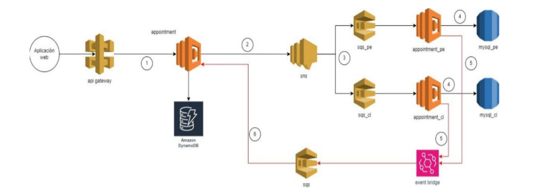

# Documentación de la API de Citas

Esta API proporciona endpoints para gestionar citas. A continuación se detallan los endpoints disponibles y su uso.

## Arquitectura del Proyecto



## Estructura del Proyecto

El proyecto está organizado en varias lambdas:

- `appointment/`: Lambda principal de citas
  - Maneja la creación y consulta de citas
  - Implementa la lógica de negocio principal
  - Utiliza AWS Lambda y DynamoDB

- `appointment-pe/`: Lambda específica para Perú
  - Adaptaciones y reglas de negocio específicas para Perú
  - Integración con servicios locales

- `appointment-ch/`: Lambda específica para Chile
  - Adaptaciones y reglas de negocio específicas para Chile
  - Integración con servicios locales

- `infraestructure/`: Configuración de infraestructura
  - Definiciones de recursos en la nube
  - Configuraciones de despliegue
  - Variables de entorno y secretos

## Endpoints

### Crear Cita
Crea una nueva cita.

**Endpoint:** `POST /appointment`

**Cuerpo de la Solicitud:**
```json
{
  "insuredId": "string",
  "scheduleId": "number",
  "countryISO": "string"
}
```

**Respuesta (200 OK):**
```json
{
  "message": "Solicitud procesada exitosamente",
  "input": {
    "insuredId": "string",
    "scheduleId": "number",
    "countryISO": "string"
  },
  "appointmentId": "string"
}
```

### Obtener Citas
Recupera todas las citas para un ID de asegurado específico.

**Endpoint:** `GET /appointment/{insuredId}`

**Parámetros de Ruta:**
- `insuredId` (requerido): El ID del asegurado

**Respuesta (200 OK):**
```json
{
  "message": "Citas recuperadas exitosamente",
  "data": [
    {
      "id": "string",
      "insuredId": "string",
      "scheduleId": "number",
      "countryISO": "string",
      "status": "string",
      "createdAt": "string",
      "updatedAt": "string"
    }
  ]
}
```

## Notas
- Todos los endpoints soportan CORS
- La API utiliza AWS Lambda y DynamoDB para el almacenamiento de datos
- Se utiliza Amazon RDS (PostgreSQL) para el almacenamiento regional de citas
- Se utiliza Amazon SQS para la gestión de colas y procesamiento asíncrono
- Se utiliza Amazon EventBridge para la integración y el enrutamiento de eventos
- Las citas se procesan de forma asíncrona utilizando SNS para notificaciones

## Pruebas de la API

Se recomienda utilizar Postman para probar los endpoints de la API. Puedes realizar solicitudes HTTP (GET y POST) a los endpoints documentados, enviar los cuerpos de ejemplo y verificar las respuestas directamente desde Postman. 